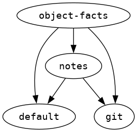

# repository-facts

Store facts about git objects (e.g. commits, tags) using [git notes](https://git-scm.com/docs/git-notes) and [JSON Lines](https://jsonlines.org/).

> [!WARNING]
> Early prototype. Do **not** use.

## Development

### Developer environment

The file [`devenv.nix`](./devenv.nix) declares a developer environment for this project. This file is used by [devenv](https://github.com/cachix/devenv) to create such environment. If you're cloning this repository and not using devenv, you can safely ignore this file. However, you can still use it as a reference to understand the project's required dependencies.

### Tasks to manage the project

This project uses a [`bb.edn`](./bb.edn) file to define a few [Babashka tasks](https://book.babashka.org/#tasks). You can type `bb tasks` to view them. Some tasks might work only on Linux.

### Namespace dependency graph

This graph represents the dependencies between the namespaces of this project. The graph was generated by [clj-hiera](https://github.com/greglook/clj-hiera).

